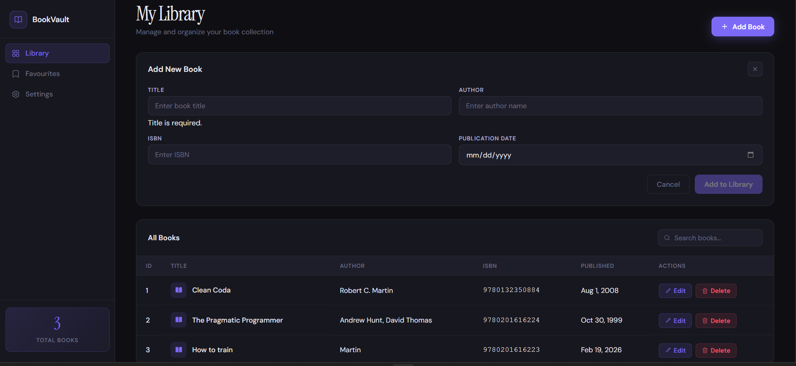

# 📚 BookVault – Full‑Stack Book Management System
> A modern CRUD application built with Angular & ASP.NET Core

BookVault is a full‑stack web application that allows users to create, read, update, and delete books through a clean, responsive UI and a RESTful API.  
The backend uses **ASP.NET Core Web API** with an in‑memory data store, while the frontend is built using **Angular standalone components** with a fully custom UI.


---

## 📑 Table of Contents

- [Overview](#-overview)
- [Features](#-features)
- [Technologies Used](#-technologies-used)
- [Architecture](#️-architecture)
- [Prerequisites](#-prerequisites)
- [How to Run the Project](#️-how-to-run-the-project)
  - [Run Backend (ASP.NET Core)](#run-backend-aspnet-core)
  - [Run Frontend (Angular)](#run-frontend-angular)
- [Best Practices Followed](#-best-practices-followed)
- [Project Structure](#-project-structure)
- [API Endpoints](#-api-endpoints)
- [Future Enhancements](#-future-enhancements)

---

## 🔍 Overview

BookVault is a full‑stack CRUD application designed to demonstrate:

- Modern Angular development using standalone components
- REST API development with ASP.NET Core
- Clean UI/UX with custom CSS
- End‑to‑end CRUD operations
- Component‑based architecture
- Clean code and best practices

This project is ideal for learning, portfolio showcasing, or extending into a full production system.

---

## ✨ Features

### 📘 Book Management
- Add new books
- Edit existing books
- Delete books with a custom modal confirmation
- View all books in a styled table
- Auto-refresh after CRUD operations

### 🎨 UI/UX
- Fully custom dark theme
- Sidebar navigation
- Animated collapsible form panel
- Smooth transitions
- Custom delete confirmation modal

### 🧠 Form Validation
- Required fields
- Max length validation
- Prevent future publication dates
- Real-time validation messages

---

## 🧰 Technologies Used

### Frontend
- Angular 17 (Standalone Components)
- TypeScript
- HTML5
- CSS3 (Custom UI)
- RxJS
- Angular FormsModule & CommonModule

### Backend
- ASP.NET Core Web API
- C#
- In‑memory data store
- Swagger / OpenAPI

### Tools
- Visual Studio Code
- .NET SDK 7/8
- Node.js + Angular CLI

---

## 🏗️ Architecture

```
Frontend (Angular)  →  REST API  →  Backend (ASP.NET Core)
```

- Angular handles UI, routing, forms, and API calls
- ASP.NET Core exposes REST endpoints
- Data stored in an in‑memory list (no database)

---

## 📦 Prerequisites

### Frontend Requirements
- Node.js (v18+ recommended)
- Angular CLI

```bash
npm install -g @angular/cli
```

### Backend Requirements
- .NET SDK 7.0 or 8.0

### Optional
- VS Code / Rider
- Postman for API testing

---

## ▶️ How to Run the Project

### Run Backend (ASP.NET Core)

**Windows / macOS / Linux**
```bash
cd backend
dotnet restore
dotnet run
```

Backend runs at: `http://localhost:5059`  
Swagger UI: `http://localhost:5059/swagger`

---

### Run Frontend (Angular)

**Windows / macOS / Linux**
```bash
cd frontend/book-manager-frontend
npm install
ng serve
```

Frontend runs at: `http://localhost:4200`

---

## 🧹 Best Practices Followed

- Angular standalone component architecture
- Clean separation of concerns
- Strong TypeScript typing
- Reusable UI components
- RESTful API design
- No direct DOM manipulation
- Consistent naming conventions
- Proper error handling
- Modular service-based API calls
- Custom modal instead of browser `confirm()`

---

## 📁 Project Structure

```
BookVault-Full-Stack-Book-Management-System/
│
├── backend/                     # ASP.NET Core Web API
│   ├── Controllers/
│   ├── Models/
│   ├── Services/
│   └── Program.cs
│
└── frontend/
    └── book-manager-frontend/   # Angular App
        ├── src/app/
        │   ├── components/
        │   ├── services/
        │   ├── models/
        │   └── app.ts
        └── angular.json
```

---

## 🔗 API Endpoints

| Method | Endpoint | Description |
|--------|----------|-------------|
| `GET` | `/api/books` | Retrieve all books |
| `GET` | `/api/books/{id}` | Retrieve a single book |
| `POST` | `/api/books` | Create a new book |
| `PUT` | `/api/books/{id}` | Update an existing book |
| `DELETE` | `/api/books/{id}` | Delete a book |

---

## 🔮 Future Enhancements

### 🌟 UI/UX
- Light/Dark theme toggle
- Toast notifications
- Pagination
- Sorting & filtering

### 🌐 Backend
- Replace in‑memory storage with SQL Server / PostgreSQL
- Add authentication (JWT)
- Add user accounts & roles

### 📱 Features
- Favorites list
- Categories & tags
- Export book list (PDF/CSV)
- Dashboard with charts

---

